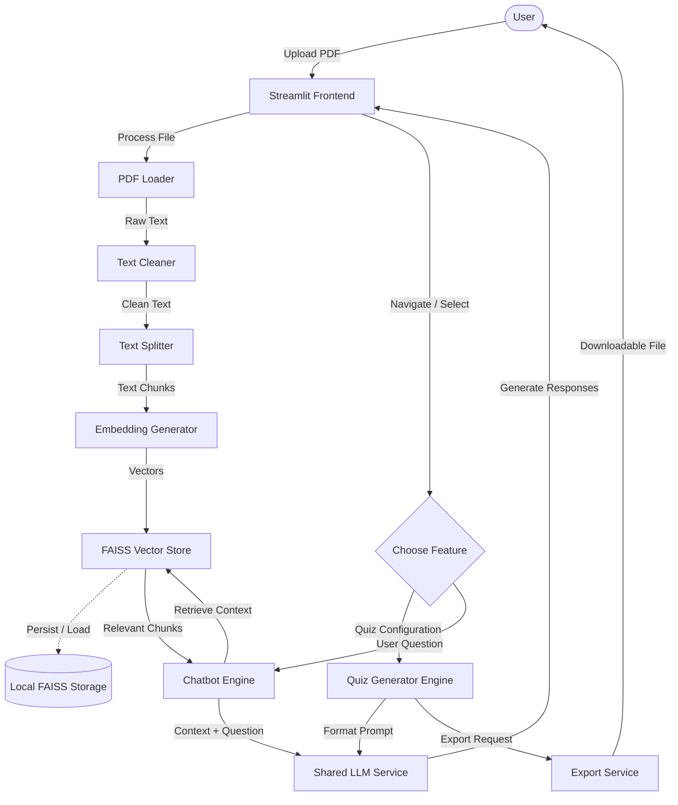

# PDF Intelligence HuB - AI

PDF Intelligence HuB - AI is a production-ready, modular AI document analysis application built using Python, Streamlit, and LangChain. 

The application utilizes a unified document processing pipeline: users upload a PDF document once, and it is validated, cleaned, sliced into semantic chunks, vectorized using local Sentence Transformers, and saved in a local FAISS index. Once indexed, the user can choose between generating custom educational quizzes or chatting with a Retrieval-Augmented Generation (RAG) chatbot that references source page numbers and responds strictly using the PDF content.

---

## Architecture Flow



---

## Key Features

1. **AI Quiz Generator**:
   - Create custom practice exams (Multiple Choice, True/False, Fill in the Blanks, Short Answers).
   - Configure difficulty levels (Easy, Medium, Hard) and length (5, 10, 20, or 30 questions).
   - Interactive grading interface: Take the quiz inside the app, check scores, and view educational explanations.
   - Export to formatted **PDF**, **Microsoft Word (DOCX)**, or **TXT** formats.

2. **Grounded AI PDF Chatbot**:
   - High-fidelity QA chatbot using Retrieval-Augmented Generation (RAG).
   - Cites source page numbers as clickable page badge pills.
   - Grounded answering system: strictly uses document facts and responds *"I couldn't find this information in the uploaded document."* if details are missing.
   - Preserves message context and supports chat resets.

3. **Smart PDF Pipeline**:
   - Detects encrypted or corrupted PDFs.
   - Strips excess spacing and page artifacts.
   - Tracks unique file hashes (MD5) to cache processed indexes locally. Opening a previously processed PDF bypasses embedding generation and loads instantly.

---

## Technology Stack

- **Frontend**: Streamlit
- **Backend & PDF Extraction**: Python 3.12+, `pdfplumber`
- **AI Framework & Vector DB**: LangChain, FAISS CPU, `sentence-transformers/all-MiniLM-L6-v2`
- **Integrations**: Google Gemini API, OpenAI GPT API
- **Exporters**: `reportlab` (PDF), `python-docx` (Word)
- **Configuration**: YAML, Python Dotenv

---

## Folder Structure

```text
PDF-Intelligence-HuB-AI/
├── .env.example
├── .env
├── .gitignore
├── README.md
├── requirements.txt
├── config.yaml
├── app.py
├── assets/
├── logs/
│   └── app.log
├── vector_store/               # Caches FAISS indexes per file MD5
│   └── [md5_hash]/
│       ├── index.faiss
│       ├── index.pkl
│       └── pages.json
├── uploaded_pdfs/              # Stores uploaded files temporarily
├── src/
│   ├── __init__.py
│   ├── config.py
│   ├── constants.py
│   ├── logger.py
│   ├── pdf_loader.py
│   ├── text_cleaner.py
│   ├── text_splitter.py
│   ├── embedding_model.py
│   ├── vector_database.py
│   ├── llm_service.py
│   ├── prompt_templates.py
│   ├── quiz_generator.py
│   ├── chatbot.py
│   ├── session_manager.py
│   └── export_service.py
├── ui/
│   ├── __init__.py
│   ├── components.py
│   ├── home.py
│   ├── sidebar.py
│   ├── quiz_page.py
│   └── chatbot_page.py
└── tests/
    ├── test_pdf_loader.py
    ├── test_text_cleaner.py
    └── test_vector_db.py
```

---

## Installation & Setup

Follow these steps to run the project locally on your machine:

### 1. Clone the Repository
```bash
git clone https://github.com/yourusername/PDF-Intelligence-HuB-AI.git
cd PDF-Intelligence-HuB-AI
```

### 2. Create a Virtual Environment
We recommend using Python 3.12 or newer.

**On Windows:**
```powershell
python -m venv venv
venv\Scripts\activate
```

**On macOS / Linux:**
```bash
python3 -m venv venv
source venv/bin/activate
```

### 3. Install Dependencies
```bash
pip install -r requirements.txt
```

### 4. Configuration
Create a copy of `.env.example` named `.env` and input your API keys:
```env
GEMINI_API_KEY=your_gemini_api_key_here
OPENAI_API_KEY=your_openai_api_key_here
```
*Note: Only one API key is required depending on your choice of provider (Gemini is configured as default).*

If you want to customize default settings, edit `config.yaml`:
- Swapping between LLM providers (`gemini`, `openai`, `custom`).
- Editing chunk sizes, overlap parameters, or local upload limits.

---

## Running the Application

Start the Streamlit interface:
```bash
streamlit run app.py
```

Open `http://localhost:8501` in your browser.

---

## Running Tests

Execute the automated test suite with `pytest`:
```bash
pytest
```

---

## Troubleshooting

- **FAISS Deserialization Error**: If you receive a pickle/deserialization warning, ensure you trust the locally saved indices. The application explicitly passes `allow_dangerous_deserialization=True` to load local indices, which is safe for databases you generate.
- **Scanned/Image PDFs**: The pipeline extracts text dynamically. If your PDF is scanned or consists only of image layers, text extraction will fail. Use native digital text PDFs.
- **API Key Failures**: Ensure your keys are copied accurately in `.env` or in the sidebar settings.

---

## License

Distributed under the MIT License. See `LICENSE` for more information.
